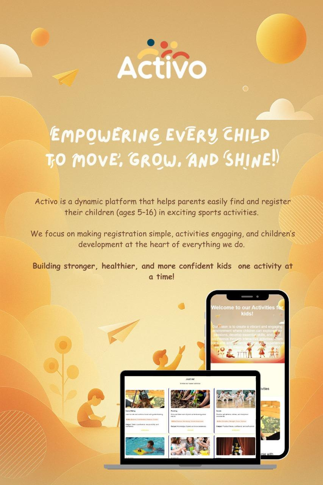

<p align="center">
  
</p>
# Activo

### Kids Activities Management Website

**Activo** is a front-end web application designed to help parents explore, manage, and enroll their children in different activities, while also providing administrators with an organized view of activities and participants.

The website brings together activity discovery, coach information, child registration, enrollment, evaluation, schedules, and parent management in one simple and interactive platform.

---

## Project Overview

Activo was created to provide an engaging and organized environment where parents can discover activities for their children and manage their participation.

The platform includes different types of activities such as:

- Swimming
- Karate
- Horse Riding
- Theatre Arts
- Gardening
- Handicrafts

Each activity is connected with information such as its coach, objective, and requirements.

The website also includes dedicated areas for parents and administrators.

---

## Main Features

### Activity Exploration

Users can browse available activities and view different options for children.

The activities page presents several activity categories including sports, arts, and hands-on learning experiences.

### Coaches

The website includes a coaches section where users can view information about the available coaches.

Some coaches also have dedicated schedule pages that show their weekly availability.

### Child Registration

Parents can register a new child through the registration form.

The form includes fields such as:

- First name
- Last name
- Date of birth
- Age
- Gender
- Phone number
- Email
- Photo

The website performs validation before registration, including:

- Required field validation
- Name validation
- Phone number validation
- Email validation
- Minimum age validation

Registered child names are stored using the browser's `localStorage`.

### Parent Dashboard

The Parent Dashboard displays registered children.

Parents can sort children by:

- Name A-Z
- Name Z-A
- Age from youngest to oldest
- Age from oldest to youngest

Children registered through the website can also be added dynamically to the dashboard using data stored in `localStorage`.

### Activity Enrollment

Parents can select a registered child and enroll them in one or more activities.

Activities can be filtered according to:

- Coach
- Prerequisite
- Objective

After enrollment, the system displays a confirmation containing the selected child and enrolled activities.

### Activity Evaluation

Users can evaluate activities by:

- Selecting an activity
- Choosing a rating
- Providing feedback

The form validates that an activity and rating have been selected before submission.

### Coach Schedules

The website includes schedule pages for coaches such as:

- Faisal Ahmed
- Omar Khalid

The schedule page dynamically displays the start date of the current week.

### Administrator Dashboard

Activo also contains an Administrator Dashboard used to display and manage activity-related information.

A "More" interaction is included to reveal additional child records when needed.

### Website Customization

The homepage includes a **Customize** button that changes the visual appearance of the hero section.

The project also includes an alternative stylesheet, `style2.css`, which provides a different visual theme.

---

## User Flow

```text
                    Activo
                       |
          ┌────────────┴────────────┐
          |                         |
       Parent                  Administrator
          |
          ├── View Activities
          |
          ├── View Coaches
          |
          ├── Register Child
          |
          ├── Manage Children
          |
          ├── Enroll in Activities
          |
          └── Evaluate Activities

---

## Team Members

Activo was developed by:

- **Nora Alkhudair**
- **Norah Aldalal**
- **Shroog Alotaibi**
- **Malak Basloom**
- **Ghadah Alshaibani**
